# MUHAMMAD FAEEZ SHABBIR

**Full Stack & AI Engineer**

Building production AI systems and scalable full stack platforms. 
4+ years across startups, freelance, and corporate engineering. 
Currently at **Visor Dynamics** — LangChain-powered pipelines, geospatial intelligence, 
and architecture decisions that hold up in production.

 

 

Lahore, Pakistan · mfaeezshabbir@gmail.com

Ex: Intel oneAPI Ambassador · Microsoft Learn Student Ambassador · Founder, DevHack Club · IEEE Leadership @ IUB

---

## What I'm Building

At **Visor Dynamics**, I build systems that turn AI and geospatial data into production-grade intelligence platforms.

- LangChain-powered AI pipelines for structured reasoning and tool use
- Geospatial intelligence systems for real-world mapping and analytics
- Backend architectures designed for scale, reliability, and observability
- Systems that move from prototype to production without rewrites

---

## Engineering Principles

- Systems over features — architecture that scales before it needs to
- Production-first thinking from day one
- Clean separation between logic, data, and orchestration
- Reliability and maintainability over cleverness

---

## Tech Stack

### Core Languages

### Frontend

### Backend & APIs

### AI & Data Systems

### Infrastructure

---

## Work in Motion

